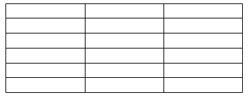
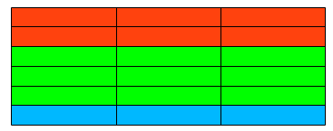
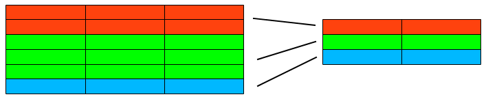
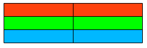
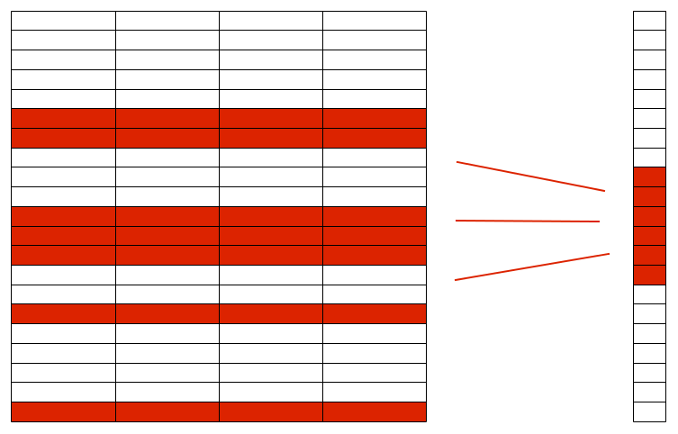
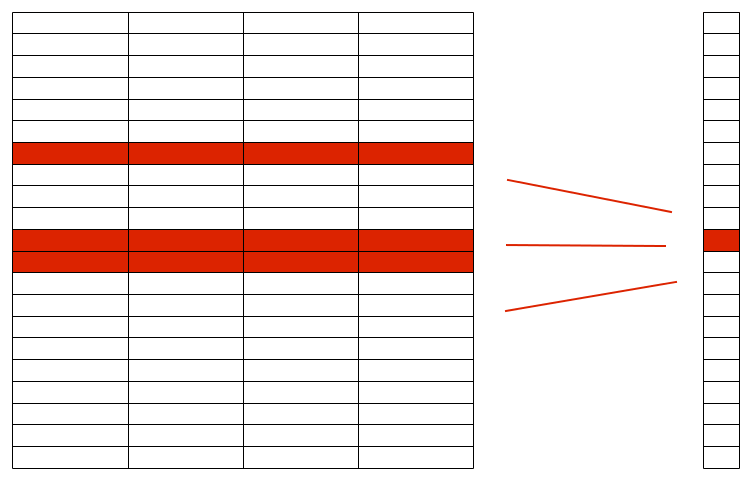

Repaso y algunos tips sobre consultas en SQL, rendimiento, y ORM de Django
--------------------------------------------------------------------------

* Repaso mega super rápido de consultas simples
* Multiples froms y joins
* Agrupamiento
* Consultas anidadas y correlacionadas
* Índices
* ORM de Django

Tablas para los ejemplos
------------------------

::

    provincias:

    id |  nombre
    ---+---------
    p1 | santa fe
    p2 | cordoba
    p3 | buenos aires

    ciudades:

    id  | nombre           | provincia | habitantes | tipo
    ----+------------------+-----------+------------+------
    c1  | rafaela          | p1        |  100000    | b
    c2  | santa fe capital | p1        |  400000    | a
    c3  | cordoba capital  | p2        | 1300000    | a
    c4  | mina clavero     | p2        |    9000    | c
    c5  | londres          | p4        |     100    | d

Repaso mega super rápido de consultas simples
---------------------------------------------

.. code-block:: sql

    select * from ciudades
    where provincia = 'p2' and habitantes > 10000
    order by habitantes desc;

    select count(*) from ciudades;

    select id, nombre as name from ciudades;

    select nombre, (habitantes > 100000) as es_grande 
    from ciudades;

    update ciudades set habitantes = 0 where tipo = 'c';

    delete ciudades where tipo = 'a';

Qué da esto?

.. code-block:: sql

    select id, count(*) from ciudades; 
    
Multiples froms vs joins
------------------------

Seguro que es lo que buscás?

.. code-block:: sql

    select * from ciudades, provincias;

Esto no es del todo eficiente

.. code-block:: sql

    select * from ciudades, provincias 
    where ciudades.provincia = provincias.id;

Bien!

.. code-block:: sql

    select * from ciudades inner join provincias 
    on ciudades.provincia = provincias.id;

Diferentes joins
----------------

Solo que estén en "ambos" lados

.. code-block:: sql

    select * from ciudades inner join provincias 
    on ciudades.provincia = provincias.id; 

Si una ciudad no tiene provincia, entra igual

.. code-block:: sql

    select * from ciudades left join provincias 
    on ciudades.provincia = provincias.id; 

Si una provincia no tiene ciudad, entra igual

.. code-block:: sql

    select * from ciudades right join provincias 
    on ciudades.provincia = provincias.id; 

Ciudades sin provincia, provincia sin ciudades

.. code-block:: sql

    select * from ciudades full outer join provincias 
    on ciudades.provincia = provincias.id; 

Agrupamiento: noción básica
---------------------------

Hacemos una consulta que "descubre" X filas

Agrupamiento: noción básica
---------------------------

Definimos cómo agrupar esas filas en Y grupos, con una o varias filas por grupo

Agrupamiento: noción básica
---------------------------

Definimos cómo construir una nueva fila a partir de cada grupo

Agrupamiento: noción básica
---------------------------

Se devuelve el conjunto de las filas generadas por cada grupo

Agrupamiento: ejemplos simples
------------------------------

Devolvemos campos o agregaciones por cada grupo

.. code-block:: sql

    select tipo, count(*) from ciudades
    group by tipo;

Si un campo no está en el grupo, no se puede devolver sin agregarlo

.. code-block:: sql

    select tipo, habitantes from ciudades
    group by tipo;

Podemos agrupar por varios campos, y poner varias agregaciones

.. code-block:: sql

    select tipo, provincia, count(*), sum(habitantes) from ciudades
    group by tipo, provincia;

Agrupamiento: filtros
---------------------

Podemos filtrar por los campos devueltos y por los no devueltos

.. code-block:: sql

    select tipo, count(*) from ciudades
    where habitantes <= 100000
    and tipo <> 'd'
    group by tipo;

Y también podemos filtrar los grupos por el resultado de las agregaciones

.. code-block:: sql

    select tipo, sum(habitantes) as total_habitantes 
    from ciudades
    group by tipo
    having sum(habitantes) > 1000000;

Agrupamiento: ordenamiento
--------------------------

Esto no funciona, porque el ordenamiento se hace sobre los grupos ya armados

.. code-block:: sql

    select tipo, count(*) from ciudades
    group by tipo
    order by habitantes;

Esto sí funciona

.. code-block:: sql

    select tipo, count(*) from ciudades
    group by tipo
    order by tipo;

Y esto también!

.. code-block:: sql

    select tipo, count(*) as cantidad_ciudades 
    from ciudades
    group by tipo
    order by cantidad_ciudades;

Agrupamiento: no solo por tener valores iguales
-----------------------------------------------

Agrupamos ciudades grandes y chicas

.. code-block:: sql

    select (habitantes > 100000) as es_grande, 
           count(*) from ciudades
    group by es_grande;

Y es combinable con las cosas que vimos antes

.. code-block:: sql

    select tipo, (habitantes > 100000) as es_grande, 
           count(*) from ciudades
    group by tipo, es_grande;

Agrupamiento sin group by
-------------------------

Si usamos alguna función de agregación para devolver alguno de los campos de la consulta no teniendo un group by, se asume que estamos intentando hacer un agrupamiento donde agrupamos **todas** las filas de la consulta, en un solo grupo. Y a partir de ese punto se aplican las reglas que vimos antes sobre cómo podemos devolver, filtrar y ordenar al agrupar.

No podemos, id no es un campo por el cual estemos agrupando

.. code-block:: sql

    select id, count(*) from ciudades; 

Podemos devolver varias funciones de agregación juntas no es necesario hacer muchas consultas!

.. code-block:: sql

    select sum(habitantes), count(*) from ciudades;

No podemos ordenar por campos no devueltos en el grupo

.. code-block:: sql

    select count(*) from ciudades order by habitantes; 

Consultas dentro de consultas
-----------------------------

Hay dos tipos, a simple vista parecen lo mismo, pero son muy diferentes!

* Consultas anidadas
* Consultas correlacionadas

La diferencia está en si utilizamos o no dentro de la subconsulta, datos que se obtienen de la fila "actual" de la consulta contenedora.

Consultas dentro de consultas
-----------------------------

Hay dos tipos, a simple vista parecen lo mismo, pero son muy diferentes!

* Consultas anidadas        <-- **todo bien**
* Consultas correlacionadas <-- **con ciudado!**

La diferencia está en si utilizamos o no dentro de la subconsulta, datos que se obtienen de la fila "actual" de la consulta contenedora.

Consultas dentro de consultas: consultas anidadas
-------------------------------------------------

Ejemplo

.. code-block:: sql

    select * from provincias 
    where id in (select provincia from ciudades
                 where tipo = 'a');

Hace solo 2 consultas. Primero calcula la consulta anidada, y luego hace la consulta que la contiene usando la tbala resultante de la anidada.

Consultas dentro de consultas: consultas correlacionadas
--------------------------------------------------------

Ejemplo

.. code-block:: sql

    select * from provincias 
    where (select sum(habitantes) from ciudades
           where provincia = provincias.id) > 1000000;

Hace n+1 consultas. Por cada fila que va encontrando de la consulta contenedora, tiene que volver a ejecutar la subconsulta.

Pocas veces el motor de la base de datos puede encontrar alguna manera de evitar esa cantidad de consultas.

Por lo general podemos expresar lo mismo con alguna combinación de join y group, mucho más fácil de optimizar para el motor. En el ejemplo sería:

.. code-block:: sql

    select provincias.id, provincias.nombre from provincias 
    left join ciudades on provincias.id = ciudades.provincia
    group by provincias.id, provincias.nombre
    having sum(habitantes) > 1000000;

Consultas dentro de consultas: inception
----------------------------------------

Podemos seguir agregando todas las subconsultas que queramos, siempre teniendo cuidado de que no sean correlacionadas. Cuando agregamos correlacionadas podemos estar multiplicando por n la cantidad de consultas.

Ejemplo

.. code-block:: sql

    select * from provincias 
    where id in (select provincia from ciudades
                 where tipo = (select tipo from ciudades 
                               where habitantes = (select max(habitantes)
                                                   from ciudades)));

Índices
-------

* El motor es muy inteligente pero no es mágico, hay que ayudarlo un poco para que tenga un rendimiento óptimo en las consultas.

* Los índices pueden ayudar a acelerar consultas si son bien usados, o pueden ralentizar la db y consumir excesivo espacio sin otorgar mejoras si son mal usados.

* La clave es entender de qué manera el motor va a recorrer nuestros datos a la hora de realizar nuestras consultas.

Índices: noción básica
----------------------

* Una estructura (árbol) guardada de forma separada.
* Cada nodo del árbol contiene solamente un valor (o un subconjunto pequeño de valores) de una o varias filas, y referencias a las filas propiamente dichas que contienen esos valores. Ej: (provincia = 'p1') --puntero--> [fila x, fila y]
* Es super eficiente a la hora de encontrar un valor dentro de sus nodos con condiciones de igualdad, mayor o menor (no con cosas como "like", "ilike", etc.). Con lo cual en muy poco tiempo podemos tener las referencias a las filas que tienen esos valores.
* Necesita ser actualizado cada vez que se modifican datos en la tabla.

Índices: cómo se utilizan en una consulta
-----------------------------------------

Para obtener las filas que cumplan con una condición determinada, el motor puede que tenga que hacer un:

* Table Scan
* Index Scan
* Index Seek

Vamos a ver **bastante por arriba y de forma simplificada** cuándo se hace cada cosa, y qué consecuencias tiene.

Índices: cómo se utilizan en una consulta: Table Scan
-----------------------------------------------------

No usamos un índice. Hay que recorrer toda la tabla, fila por fila, evaluando la condición en cada fila. Es lo peor que nos puede pasar.

Ejemplo: si no tenemos índice por campo id, esto hace un table scan

.. code-block:: sql

    select * from ciudades where id = 'c1';

Índices: cómo se utilizan en una consulta: Index Scan
-----------------------------------------------------

Recorremos el índice, valor por valor. Pero probablemente no recorra todo el índice, por lo general puede encontrar de manera rápida desde qué nodo hasta qué nodo recorrer (gracias a que el índice está ordenado). Tiene un rendimiento aceptable.

Ejemplo: si tenemos índice por campo id, esto hace un index scan

.. code-block:: sql

    select * from ciudades where id < 'c1' and id > 'c4';

Índices: cómo se utilizan en una consulta: Index Seek
-----------------------------------------------------

Puede ir directamente al nodo que referencia a las filas que busca, sin recorrer secuencialmente nada. WIN!

Ejemplo: si tenemos índice por campo provincia, esto hace un index seek

.. code-block:: sql
    
    select * from ciudades where provincia = 'p1';

Índices: cómo se utilizan en una consulta: resumen
--------------------------------------------------

.. image:: index_memes.png
    :width: 80%
    :align: center

Índices: cómo se utilizan en una consulta: consultas complejas combinan métodos
-------------------------------------------------------------------------------

Para resolver la consulta, el motor puede tener que aplicar varias de esas técnicas en distintas partes de la consulta. Por ejemplo, si tenemos un índice por provincia:

.. code-block:: sql

    select * from ciudades
    where nombre like '%santa%'
    and provincia = 'p1';

Probablemente esto haga un index seek primero por el campo provincia, y luego un table scan (ya en memoria sobre un grupo pequeño de filas) para filtrar por el like de nombre.

Índices: no abusar
------------------

* Matener índices cuesta. Si una tabla tiene muchos índices podemos afectar bastante a la performance de las modificaciones de filas en esa tabla.
* Los índices pesan en disco, y más si es por campos que tienen mucho contenido. 
* No tiene sentido indexar cosas como "descripción", ya que casi siempre se va buscar por condiciones como "like", "ilike", etc (que no se hacen usando el índice).
* El costo beneficio ya no es bueno si el campo indexado no es muy "selectivo". Ej: si filtrar por ese campo me puede devolver la mitad de la tabla, es casi lo mismo que hacer un table scan, y es al pedo mantener un índice.

SQL y ORM de Django
-------------------

Algunos tips básicos sobre cómo se aplican las cosas que vimos antes al ORM de Django.

SQL y ORM de Django: joins que evitan muchas queries
----------------------------------------------------

Esto está mal:

.. code-block:: python

    for ciudad in Ciudad.objects.all():
        print ciudad.provincia.nombre

Es equivalente a:

.. code-block:: python

    for fila in ('select * from ciudades'):
        print ('select * from provincias where id = %', fila.provincia).nombre

Estamos haciendo n+1 queries

SQL y ORM de Django: joins que evitan muchas queries
----------------------------------------------------

Esto está bien:

.. code-block:: python

    for ciudad in Ciudad.objects.all().select_related('provincia'):
        print ciudad.provincia.nombre

Es equivalente a:

.. code-block:: python

    for fila in ('select * from ciudades inner join provincias ...'):
        print fila.nombre_provincia

Estamos haciendo solo 1 query

SQL y ORM de Django: update() evita muchas queries
--------------------------------------------------

Esto **suele** estar mal:

.. code-block:: python

    for ciudad in Ciudad.objects.all():
        ciudad.habitantes = 0
        ciudad.save()

Es equivalente a:

.. code-block:: python

    for fila in ('select * from ciudades'):
        ('update ciudades set habitantes = 0 where id = %', fila.id)

Estamos haciendo n+1 queries

SQL y ORM de Django: update() evita muchas queries
--------------------------------------------------

Esto **suele** estar bien:

.. code-block:: python

    Ciudad.objects.all().update(habitantes=0)

Es equivalente a:

.. code-block:: sql

    update ciudades set habitantes = 0;

Estamos haciendo solo 1 query

SQL y ORM de Django: problemas de update()
------------------------------------------

**Ojo**: update() no es perfecto. Tiene dos problemas:

* No dispara las signals referidas a edición de modelos.
* No llama realmente al .save() del modelo. 
  
Por ende, si teníamos re-definido el método save() y es importante que sea llamado, o si queremos que las signals de edición siempre sean ejecutadas, no podemos usar update().

SQL y ORM de Django: delete() evita muchas queries
--------------------------------------------------

Todo lo mismo que con update(), mismas ventajas y mismos problemas, salvo por una sola diferencia: delete() **sí** dispara las signals referidas a borrado (pero ojo, sigue sin llamar al método delete(), ese problema sigue estando).

SQL y ORM de Django: Django entiende de agrupamiento
----------------------------------------------------

Podemos hacer lo mismo que un group by de sql con lo que django nos da, muchas veces ahorrando hacer muchas queries separadas y agrupamiento desde python.

Por ejemplo, este es un buen ejemplo de uso:

.. code-block:: python

    Ciudades.objects.values('tipo').annotate(suma_habitantes=Sum('habitantes'))

Es equivalente a:

.. code-block:: sql

    select tipo, sum(habitantes) 
    from ciudades
    group by tipo;

A lo mismo lo podríamos hacer peor de muchas formas distintas, involucrando fors de python iterando sobre valores y haciendo queries dentro. La creatividad para hacer chanchadas nunca se acaba :)

SQL y ORM de Django: Django puede morder en el agrupamiento
-----------------------------------------------------------

**Ojo**: si tenemos órdenes definidos por defecto para el modelo, o el queryset al cual le estamos aplicando el .values() ya viene con ordenamiento, los campos de ordenamiento se van a agregar al group by, "desagrupando" nuestros grupos!

Lo resolvemos sacando el orden:

.. code-block:: python

    Ciudades.objects.order_by().values('tipo').annotate(suma_habitantes=Sum('habitantes'))

SQL y ORM de Django: otros detalles sobre joins implícitos
----------------------------------------------------------

Con el select_related se hacía un poco evidente que iba a haber un join, pero no siempre es así. Cuando usamos en filtros, ordenamientos y demás cosas como "ciudad__provincia", también estamos generando joins.  

Algunas veces esos joins pueden terminar multiplicando las filas del modelo original, en esos suele servir usar .distinct() para eliminar los duplicados.

SQL y ORM de Django: Django entiende de consultas anidadas
----------------------------------------------------------

Django sabe convertir esto:

.. code-block:: python

    Ciudad.objects.filter(provincia__in=Provincia.objects.filter(nombre__in=('cordoba', 'santa fe')))

En algo como esto:

.. code-block:: sql

    select * from ciudades where provincia in (select id from provincias where nombre in ('cordoba', 'santa fe'));

SQL y ORM de Django: Django entiende de índices!
------------------------------------------------

* Por defecto, nos crea índices en los campos que son primary keys
* Por defecto, nos crea índices en los campos que son claves foráneas (apuntan a primary keys de otros modelos)

Estas dos cosas solas ya nos optimizan una **gran** cantidad de consultas, pero no es suficiente. También tenemos que encargarnos de encontrar aquellos campos muy selectivos por los que habitualmente filtramos y vale la pena crear índices.

.. code-block:: python

    class Ciudad(models.Model):
        # (...)
        tipo = models.CharField(db_index=True)

Pero recuerden: criterio, evalúen si hace falta y si vale el costo.
